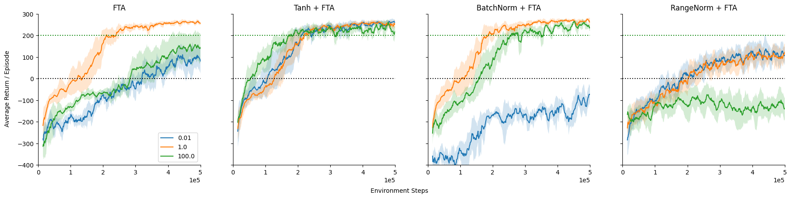
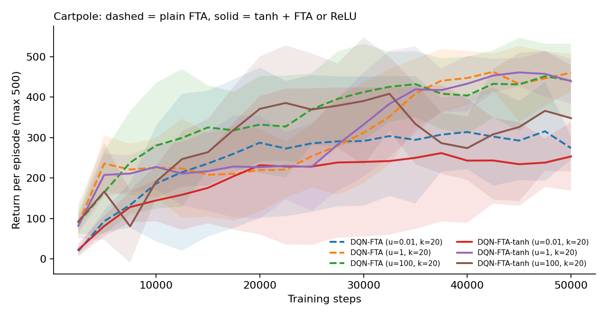
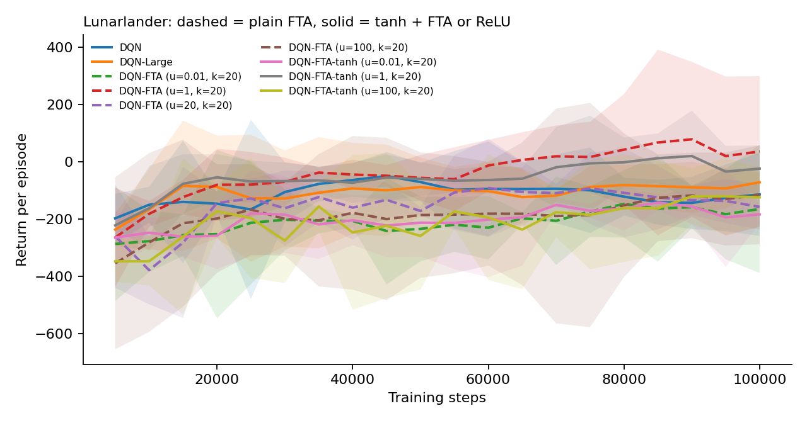

# Fuzzy Tiling Activation in Reinforcement Learning

Code, results and an interactive explainer for **[Investigate the Properties of FTA Through Empirical Experimentation](https://link.springer.com/chapter/10.1007/978-981-97-5703-9_10)** by Harsh Raj and Dilshad Shaik (ETTIS 2024, Springer *Lecture Notes in Networks and Systems*).

**Interactive explainer:** https://harsh-github007.github.io/Fuzzy-Tiling-Activation-RL/
**Preprint:** [`paper/preprint.pdf`](paper/preprint.pdf). The published version is on [Springer](https://link.springer.com/chapter/10.1007/978-981-97-5703-9_10).

[](https://colab.research.google.com/github/harsh-github007/Fuzzy-Tiling-Activation-RL/blob/main/notebooks/run_experiments.ipynb)

## The idea

**The problem it addresses:**
- When a neural network learns from a stream of experience, as a reinforcement-learning agent does, new learning can overwrite old learning. This is called interference.
- Sparse representations, where each input activates only a few neurons, reduce interference.

**What FTA is:** fuzzy tiling activation ([Pan, White and White](https://arxiv.org/abs/1911.08068)) makes a layer sparse by design.
- It splits a range [−u, u] into k tiles.
- It maps each number to a vector that lights up the tile the number falls in.
- It has soft edges, so gradients can still flow.

**The weakness:** FTA only works if the tiling bound u is set right.
- If u is too wide, the inputs crowd into one or two tiles.
- If u is too narrow, the inputs fall outside every tile, where FTA outputs zero and passes no gradient.
- The right value differs from task to task, so it has to be searched for.

**The paper's contributions:**
1. **Reproduced** the FTA vs ReLU results of Pan et al. with a deep Q-network (DQN) on LunarLander.
2. **Confirmed** that FTA is sensitive to u. It did best near u = 1 on LunarLander, but best at u = 100 on CartPole.
3. **Tested three ways** of normalising FTA's inputs: tanh, Batch Norm and Range Norm. Only **tanh** performed well at every bound tested on LunarLander, and it also fixed the bad bounds on CartPole. Its returns across random seeds also stayed unimodal, while plain DQN and untuned FTA became bimodal.

## The paper's key result



With tanh in front of FTA, every tiling bound performs well. Without it, only the right bound does. All six figures are in [`paper/figures/`](paper/figures/), with explanations on the [explainer page](https://harsh-github007.github.io/Fuzzy-Tiling-Activation-RL/).

## Re-run

Every experiment in the paper is written out in [`experiments/configs.py`](experiments/configs.py). The full set is 500,000 steps per run, with 10 runs per agent (50 for the distribution study), which comes to hundreds of CPU-hours. So the results published here come from a **reduced-scale** re-run:
- **CartPole:** 50,000 steps and 5 seeds.
- **LunarLander:** 100,000 steps and 3 seeds.

Full tables are in [`results/results.md`](results/results.md). Final return is each seed's mean over the last fifth of training, averaged across seeds, with a 95% t interval.

| Agent | CartPole | LunarLander |
| --- | ---: | ---: |
| DQN-FTA (u=1) | 450.8 ± 63.1 | 50.2 ± 230.7 |
| DQN-FTA-tanh (u=1) | 453.2 ± 38.8 | −6.6 ± 101.0 |
| DQN-FTA (u=100) | 439.5 ± 91.0 | −122.3 ± 153.9 |
| DQN-FTA-tanh (u=100) | 337.3 ± 137.8 | −132.1 ± 124.4 |
| DQN-FTA (u=0.01) | 296.3 ± 90.6 | −167.4 ± 136.2 |
| DQN-FTA-tanh (u=0.01) | 242.4 ± 81.4 | −169.3 ± 45.5 |
| DQN-FTA (u=20) | | −138.3 ± 21.6 |
| DQN | | −131.3 ± 101.2 |
| DQN-Large | | −84.9 ± 63.5 |




**What the re-run shows:**
- **Agreement with the paper:** u = 1 is the best bound in both environments, FTA at u = 1 beats plain DQN and DQN-Large on LunarLander, and tanh gives tighter intervals across seeds at u = 1.
- **Not reproduced at this scale:** tanh did not rescue the bad bounds (u = 0.01 and u = 100).
- **Caveat:** these runs are much shorter and use fewer seeds than the paper's, so LunarLander agents are still early in learning and most intervals overlap. The full-scale settings are in `paper()` in `experiments/configs.py`.

## Code

| Path | What it is |
| --- | --- |
| [`fta/layers.py`](fta/layers.py) | `FTA` layer, following Pan et al.'s definition, and `RangeNorm` |
| [`fta/agent.py`](fta/agent.py) | DQN, with ReLU, a widened ReLU layer ("DQN-Large") or FTA in the last hidden layer, and optional tanh, Batch Norm or Range Norm before FTA |
| [`experiments/configs.py`](experiments/configs.py) | Every experiment in the paper (`paper()`), and the reduced version run here (`quick()`) |
| [`experiments/run.py`](experiments/run.py) | Runs experiments in parallel, one JSON file per run in `results/raw/` |
| [`experiments/analyze.py`](experiments/analyze.py) | Learning curves with 95% Student's t intervals, results tables and charts |
| [`index.html`](index.html), [`assets/`](assets/) | The interactive explainer, including FTA re-implemented in JavaScript |
| [`paper/`](paper/) | Preprint of the paper and its figures |

```bash
pip install torch "gymnasium[box2d]" scipy matplotlib pytest
pytest tests                                   # FTA layer tests, including the paper's worked examples
python experiments/run.py quick                # reduced-scale re-run (about 20 minutes on 8 CPU cores)
python experiments/run.py paper cartpole       # one full-scale experiment from the paper
python experiments/analyze.py                  # tables and charts
npm test                                       # the explainer's JavaScript FTA
```

**Settings:**
- **Network:** 64 → 64 → Q-values, with FTA or ReLU in the last hidden layer. DQN-FTA uses η = δ = 2u/k, as in the paper.
- **Training:** Adam (learning rate 1e-4), replay buffer of 100,000, batch 64, γ = 0.99, ε-greedy with ε = 0.1. The target network is copied every 1,000 steps when one is used.

The paper does not list every hyperparameter. These values follow common settings for Pan et al.'s LunarLander experiments, and all of them can be changed in `DQNConfig`.
